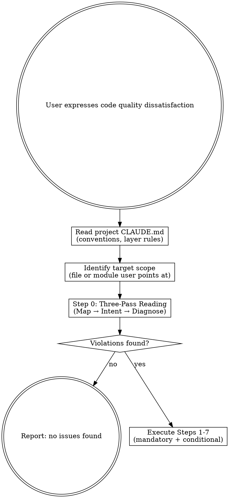

### Task 1: Scaffold — Directory, YAML Frontmatter, Overview, Trigger Flow

**Files:**
- Create: `skills/code-refactoring/SKILL.md`

**Produces:** Skill file with frontmatter, overview, trigger conditions, and decision flow diagram.

- [ ] **Step 1: Create skill directory**

```bash
mkdir -p /Users/chenqimeng/.claude/plugins/cache/claude-plugins-official/superpowers/6.0.3/skills/code-refactoring
```

- [ ] **Step 2: Write file header — YAML frontmatter, Overview, When to Use with flowchart**

Write the following to `SKILL.md`:

```markdown
---
name: code-refactoring
description: Use when the user expresses dissatisfaction with code quality — files too long, modules messy, functions disorganized, or any request to refactor, clean up, organize, or restructure code. Principles-driven: teaches code aesthetics then applies an 8-lens 7-step process.
---

# Code Refactoring

## Overview

A principles-driven code refactoring skill. Teaches the model to think in terms
of code aesthetics — thin orchestration, pure core / imperative shell,
guard/action separation, sibling-first organization — then applies a systematic
7-step process to diagnose and fix structural problems.

**The core insight**: AI reads code linearly, noticing the most salient issue
and ignoring the rest. This skill forces comprehensive diagnosis via 8 parallel
lens subagents, each carrying exactly ONE question through the full code.

Every step has explicit decision gates. Mandatory steps (0, 3, 5, 6, 7) ensure
critical architecture issues are never missed. Conditional steps (1, 2, 4) use
quantitative triggers — no vague "use your judgment."

**Style**: Rigid on process, flexible on tactics. The 10 iron rules are
non-negotiable. How you fix a violation respects project conventions.

## When to Use

Invoke when the user expresses dissatisfaction with code quality:

- "这个文件太长了" / "this file is too long"
- "这个模块很乱" / "these functions are messy"
- "重构一下" / "refactor this" / "clean up"
- "代码需要整理" / "organize the code"
- User points at a file/module and implies structural problems
- Any mention of "refactor", "clean up", "organize", "restructure" near code

**Also invoke when**: You catch yourself thinking "this file is getting unwieldy"
or "these functions are in the wrong place" — the skill catches problems you'd
miss on a linear read.


```

- [ ] **Step 3: Verify frontmatter character count**

```bash
head -5 SKILL.md | grep 'description:' | wc -c
```
Expected: ≤ 1024 characters (currently ~280 chars). If over, tighten the description.

- [ ] **Step 4: Commit**

```bash
cd /Users/chenqimeng/.claude/plugins/cache/claude-plugins-official/superpowers/6.0.3
git add skills/code-refactoring/SKILL.md
git commit -m "feat(code-refactoring): scaffold — frontmatter, overview, trigger flow

Co-Authored-By: Claude <noreply@anthropic.com>"
```

---

