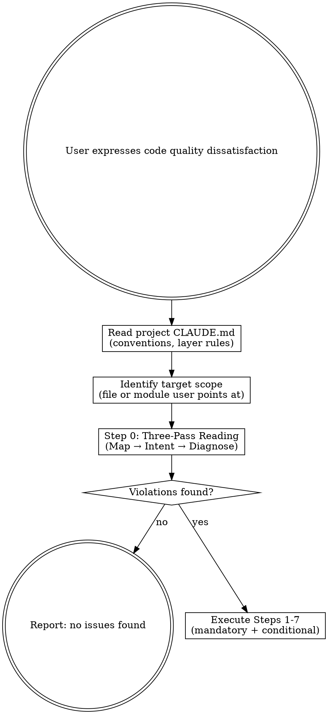

# Code Refactoring Skill — Implementation Plan

> **For agentic workers:** REQUIRED SUB-SKILL: Use superpowers:subagent-driven-development (recommended) or superpowers:executing-plans to implement this plan task-by-task. Steps use checkbox (`- [ ]`) syntax for tracking.

**Goal:** Create a single-file superpowers skill (`code-refactoring/SKILL.md`) that teaches AI models a principles-driven, 8-lens, 7-step code refactoring workflow based on code aesthetics philosophy.

**Architecture:** Single SKILL.md file following superpowers conventions. Self-contained — no supporting files needed. The skill file IS the deliverable.

**Tech Stack:** Markdown, YAML frontmatter, dot/graphviz for decision flow diagram

## Global Constraints

- Target path: `/Users/chenqimeng/.claude/plugins/cache/claude-plugins-official/superpowers/6.0.3/skills/code-refactoring/SKILL.md`
- YAML frontmatter ≤ 1024 chars, name lowercase-hyphenated, description third-person "Use when..."
- Iron rules in ALL CAPS code blocks
- No narrative/storytelling — direct instructional language
- Spec reference: `docs/superpowers/specs/2026-06-30-code-refactoring-design.md`

---

## File Structure

```
skills/code-refactoring/
  SKILL.md            ← Entire skill in one file
```

---

### Task 1: Scaffold — Directory, YAML Frontmatter, Overview, Trigger Flow

**Files:**
- Create: `skills/code-refactoring/SKILL.md`

**Produces:** Skill file with frontmatter, overview, trigger conditions, and decision flow diagram.

- [ ] **Step 1: Create skill directory**

```bash
mkdir -p /Users/chenqimeng/.claude/plugins/cache/claude-plugins-official/superpowers/6.0.3/skills/code-refactoring
```

- [ ] **Step 2: Write file header — YAML frontmatter, Overview, When to Use with flowchart**

Write the following to `SKILL.md`:

```markdown
---
name: code-refactoring
description: Use when the user expresses dissatisfaction with code quality — files too long, modules messy, functions disorganized, or any request to refactor, clean up, organize, or restructure code. Principles-driven: teaches code aesthetics then applies an 8-lens 7-step process.
---

# Code Refactoring

## Overview

A principles-driven code refactoring skill. Teaches the model to think in terms
of code aesthetics — thin orchestration, pure core / imperative shell,
guard/action separation, sibling-first organization — then applies a systematic
7-step process to diagnose and fix structural problems.

**The core insight**: AI reads code linearly, noticing the most salient issue
and ignoring the rest. This skill forces comprehensive diagnosis via 8 parallel
lens subagents, each carrying exactly ONE question through the full code.

Every step has explicit decision gates. Mandatory steps (0, 3, 5, 6, 7) ensure
critical architecture issues are never missed. Conditional steps (1, 2, 4) use
quantitative triggers — no vague "use your judgment."

**Style**: Rigid on process, flexible on tactics. The 10 iron rules are
non-negotiable. How you fix a violation respects project conventions.

## When to Use

Invoke when the user expresses dissatisfaction with code quality:

- "这个文件太长了" / "this file is too long"
- "这个模块很乱" / "these functions are messy"
- "重构一下" / "refactor this" / "clean up"
- "代码需要整理" / "organize the code"
- User points at a file/module and implies structural problems
- Any mention of "refactor", "clean up", "organize", "restructure" near code

**Also invoke when**: You catch yourself thinking "this file is getting unwieldy"
or "these functions are in the wrong place" — the skill catches problems you'd
miss on a linear read.


```

- [ ] **Step 3: Verify frontmatter character count**

```bash
head -5 SKILL.md | grep 'description:' | wc -c
```
Expected: ≤ 1024 characters (currently ~280 chars). If over, tighten the description.

- [ ] **Step 4: Commit**

```bash
cd /Users/chenqimeng/.claude/plugins/cache/claude-plugins-official/superpowers/6.0.3
git add skills/code-refactoring/SKILL.md
git commit -m "feat(code-refactoring): scaffold — frontmatter, overview, trigger flow

Co-Authored-By: Claude <noreply@anthropic.com>"
```

---

### Task 2: Iron Rules Block

**Files:**
- Modify: `skills/code-refactoring/SKILL.md` (append after When to Use section)

**Produces:** 10 iron rules in ALL CAPS code block with anti-rationalization preamble.

- [ ] **Step 1: Append the Iron Rules section**

```markdown
## Iron Rules

These are non-negotiable. Violating any of them means the refactoring is wrong.

```
NO MOVING CODE WITHOUT UNDERSTANDING ITS SIBLINGS FIRST
NO SPLITTING WITHOUT NAMING THE ORCHESTRATOR
NO INLINE IMPORTS SURVIVE WITHOUT JUSTIFICATION
NO FALLBACK — every step fails LOUD with an actionable error message
NO REFACTORING WITHOUT THREE PASSES — Map, Intent, Diagnose
NO AWKWARD FUNCTION AS ARCHITECTURE CENTER — find natural behaviors
NO INCONSISTENT NAMES IN THE SAME DOMAIN — siblings share a verb convention
NO SINGLE-PASS DIAGNOSIS — 8 lenses, one question each, every lens reports
NO INLINE VALUES — string building goes to dedicated formatters, magic literals go to constants
NO REINVENTING — search the codebase before extracting; generalize repeated patterns, don't duplicate them
```

**The letter of these rules IS the spirit.** If you find yourself thinking "this
is a special case" — it's not. The rules exist because that exact rationalization
has been wrong every time.
```

- [ ] **Step 2: Commit**

```bash
cd /Users/chenqimeng/.claude/plugins/cache/claude-plugins-official/superpowers/6.0.3
git add skills/code-refactoring/SKILL.md
git commit -m "feat(code-refactoring): add 10 iron rules

Co-Authored-By: Claude <noreply@anthropic.com>"
```

---

### Task 3: Step 0 — Three-Pass Reading (Map + Intent)

**Files:**
- Modify: `skills/code-refactoring/SKILL.md` (append after Iron Rules)

**Produces:** Pass 1 (Map) and Pass 2 (Intent) with read rules, deliverables, forbidden actions, success criteria.

- [ ] **Step 1: Write Step 0 header + Pass 1 (Map)**

```markdown
## Step 0: Three-Pass Reading (MANDATORY)

Do NOT skip to splitting. Do NOT grep-jump. You read three times, each with a
different question. Every pass has a written deliverable. No deliverable = pass not done.

### Pass 1 — Map (Structure Mapping)

**Question**: What is in this module?

**Read method**:
1. Read the import block (first 40 lines) of EVERY file in scope — do not skip any
2. Read function/class signatures only — do NOT read implementations
3. Build an import dependency graph: which file imports what from where

**Deliverable**: Written import dependency graph + function/class signature inventory.
A mental note doesn't count. Write it down.

**Forbidden**:
- Grep for a symbol and only read those 3 lines → GREP-JUMP. Read the full import block.
- Skip the import block because "I already know what it imports" → you don't.
- Start reading implementations → that's Pass 2. Stay disciplined.

**Success criterion**: You can draw the dependency arrow direction between every
pair of modules. If you can't, you didn't finish Pass 1.
```

- [ ] **Step 2: Write Pass 2 (Intent)**

```markdown
### Pass 2 — Intent (Purpose Understanding)

**Question**: Why does each function exist? Who are its siblings?

**Read method**:
1. Read the FULL function body — from `def` to the last `return` (or end of function)
2. For each function, answer THREE questions:
   a. **What does it do?** (one-sentence behavior description)
   b. **Is its behavior natural in the domain?**
      - "Publish an article" → natural
      - "Publish an article AND update a counter AND clean up temp files" → AWKWARD
   c. **Who are its siblings?** (which other functions belong to the same domain set?)

**Deliverable**: Per-function annotation: (a) behavior description, (b) naturalness
judgment, (c) sibling assignment. Write one line per function.

**Forbidden**:
- Judge a function from its first 5 lines → read to the end. Always.
- Skip "boring" helper functions → they're often the ones in the wrong place
- Assume the function name is accurate → verify against the implementation

**Awkward function marker**: If the function's name says one thing but the
implementation does 1.5+ things, mark it `[AWKWARD]`. These become priority
split targets in Step 1. Never let an awkward function remain an architecture
center.

**Success criterion**: Every function can answer "who are its siblings?" without
hesitation. If you hesitate on any function, re-read it.
```

- [ ] **Step 3: Commit**

```bash
cd /Users/chenqimeng/.claude/plugins/cache/claude-plugins-official/superpowers/6.0.3
git add skills/code-refactoring/SKILL.md
git commit -m "feat(code-refactoring): add Step 0 Pass 1-2 — Map and Intent

Co-Authored-By: Claude <noreply@anthropic.com>"
```

---

### Task 4: Step 0 Pass 3 — 8-Lens Parallel Diagnosis

**Files:**
- Modify: `skills/code-refactoring/SKILL.md` (append after Pass 2)

**Produces:** Pass 3 with dispatch instructions, all 8 lens definitions, merge rules, severity sorting.

- [ ] **Step 1: Write Pass 3 header, dispatch instructions, Lens A-D**

```markdown
### Pass 3 — Diagnose (8 Parallel Subagents)

**Question**: What is wrong, specifically?

**The problem**: AI attention is linear. With 8 questions competing in one
context, you notice the most salient and ignore the rest. **The fix**: dispatch
8 independent subagents simultaneously, each carrying exactly ONE question.
Contexts don't contaminate.

**Dispatch all 8 at once.** Do not run them sequentially. Each subagent
receives: the full target code + its single lens question.

**Mandatory output**: Every subagent MUST produce a structured findings list
or explicitly declare "no findings." Silence is not "no findings" — silence is
"the subagent didn't run."

**Merge**: After all 8 return, the main agent merges findings → deduplicates →
sorts by severity (CRITICAL > HIGH > MEDIUM > LOW) → produces the unified
violation list that drives Steps 1-7.

```
Parallel subagents:      A ─┐
                         B ─┤
                         C ─┤
                         D ─┼─ run simultaneously → merge → unified violation list
                         E ─┤
                         F ─┤
                         G ─┤
                         H ─┘
```

#### Lens A — Fallback Lens

```
Question: Where is there silent fallback?

Look for: None → skip, except → pass, default parameters masking errors,
          try/except without re-raise, .get() with defaults hiding missing keys,
          empty except blocks

Deliverable: List of (file, line, fallback description), or "no findings"

Test: "If this fallback triggers, will anyone know?" If no → violation.
```

#### Lens B — Naming Lens

```
Question: Are sibling functions named consistently? Do names match behavior?

Look for: get_/fetch_/retrieve_ mixing in same domain, names that lie about
          behavior, private (_) vs public inconsistency among siblings

Deliverable: List of (function, violation, suggested fix), or "no findings"

Rule: Find most frequent naming pattern in domain → standardize to it.
```

#### Lens C — Dependency Lens

```
Question: Are import directions correct? Cross-package private imports? Circular refs?

Look for: layer violations (storage → core, server → transport/http),
          _internal module imports from another package, potential circular imports

Deliverable: List of (file, line, wrong import, correct direction), or "no findings"

Rule: Imports must form a DAG. Cycles mean something is wrong.
```

#### Lens D — Structure Lens

```
Question: Does each function belong in the correct module? Any awkward functions?

Look for: functions in wrong layer, functions separated from Pass 2 siblings,
          functions >30 logic lines, functions doing 2+ unrelated things,
          guard/action mixing, [AWKWARD] markers from Pass 2

Deliverable: List of (function, violation type, suggested module), or "no findings"

Rule: Every function's module should match its sibling set and its layer.
```

- [ ] **Step 2: Write Lens E-H + merge rules**

```markdown
#### Lens E — Dead Code Lens

```
Question: What is unreferenced?

Look for: functions/classes never called (grep project-wide), imports never used,
          variables assigned but never read, code paths that can never execute

Deliverable: List of (file, line, dead entity), or "no findings"

Rule: If unsure → grep. If grep finds nothing → dead.
```

#### Lens F — Type Safety Lens

```
Question: Any bare types? Union parameters? Callable[..., X]?

Look for: bare dict/list/tuple, str | set[str] on parameters,
          Callable[..., X] instead of full signature, Any outside serialization

Deliverable: List of (file, line, bare type, suggested fix), or "no findings"

Rule: Fix these inline during Steps 1-3. No separate step needed.
```

#### Lens G — Inline Values Lens

```
Question: Any inline string building? Any magic literals?

Look for: f"prefix_{id}_suffix" or "path/" + name + ".ext" inside business logic,
          bare numbers like timeout=30, max_retries=5, repeated string literals

Deliverable: List of (file, line, inline value, suggested fix), or "no findings"

Rule: String builders → dedicated formatter. Magic literals → named constant.
```

#### Lens H — Duplication & Pattern Lens

```
Question: Any function duplicated elsewhere? Any repeated pattern?

Look for: two functions doing the same thing under different names,
          functions differing by only 1-2 params, repeated structural templates,
          copy-pasted logic blocks, existing function that does what a new extraction would

Deliverable: List of (file1, func1, file2, func2, similarity), or "no findings"

Rule: Before extracting ANY new function → search codebase for existing one.
If two functions differ by ≤2 params → unify. Repeated pattern across 3+ → generalize.
```

**After all 8 return**: Merge findings. Deduplicate — one violation may appear
in multiple lenses. Sort by severity:

1. **CRITICAL**: Layer violations, circular imports, silent fallback in data paths
2. **HIGH**: Sibling separation, awkward functions, naming inconsistency
3. **MEDIUM**: Bare types, inline values, duplicated functions
4. **LOW**: Phase comments needed, minor naming tweaks

Every violation must map to at least one step in Steps 1-7. If a violation
doesn't fit any step, you're missing a step — add it.
```

- [ ] **Step 3: Commit**

```bash
cd /Users/chenqimeng/.claude/plugins/cache/claude-plugins-official/superpowers/6.0.3
git add skills/code-refactoring/SKILL.md
git commit -m "feat(code-refactoring): add Step 0 Pass 3 — 8-lens parallel diagnosis

Co-Authored-By: Claude <noreply@anthropic.com>"
```

---

### Task 5: Steps 1-4 — Split, Group + Name, Module Review, Phase Comments

**Files:**
- Modify: `skills/code-refactoring/SKILL.md` (append after Step 0)

**Consumes:** Unified violation list from Pass 3 (particularly Lens B, D, G, H findings)
**Produces:** Steps 1-4 with decision gates, skip conditions, deliverables, red flags

- [ ] **Step 1: Write Step 1 (Split Functions) + Step 2 (Group + Unify Names)**

```markdown
## Step 1: Split Functions (CONDITIONAL)

**Decision gate** — split if ANY of these are true:

| Condition | How to detect |
|---|---|
| Function >30 logic lines | Count from `def` to last statement (exclude docstrings, blank lines, decorators) |
| Does 2+ unrelated things | Pass 2 behavior description contains "and also" |
| Name can't summarize behavior | "What does this function do?" → need 2+ sentences |
| Mixes guard and action | Checks conditions AND transforms data |
| [AWKWARD] marker from Pass 2 | Function name lies, does 1.5 things |
| Contains inline string building or magic literals | f-strings, concatenation, bare numbers in business logic |

**Before extracting any new function**: Search the entire codebase for an existing
function that does the same thing (or can be adapted with ≤2 parameter changes).
If found → use/modify it instead of creating a new one. Iron rule #10.

**Skip if**: The function is a naturally complete behavior. Even if 35 lines,
if it's one coherent thing → hand to Step 4 for phase comments.

**Must deliver**: An orchestrator function name — after splitting, which function
is the caller/entry point? Name it before you start splitting.

**Red flags**:
- Splitting every long function mechanically without considering natural behavior boundaries
- Creating functions named `_helper_1`, `_helper_2` — names carry information
- Extracting a helper that already exists elsewhere in the project

---

## Step 2: Group Similar Functions + Unify Names (CONDITIONAL)

**Decision gate** — group if ANY of these are true:

| Condition | How to detect |
|---|---|
| 3+ functions do similar things but live in different files | Pass 2 sibling assignments point across files |
| Two functions have >50% duplicate logic | Visual comparison of implementations |
| A domain set is split across multiple files | e.g. "SSH signing triad" spread across 3 files |
| Sibling functions have inconsistent names | Lens B found get_/fetch_/retrieve_ mixing |
| A function duplicates an existing one elsewhere | Lens H found same behavior under different names |
| Repeated structural pattern across 3+ functions | Lens H found same template with only data varying |

**Naming unification rules**:
1. Find the most frequent naming pattern in the domain set → use as standard
2. Rename the rest to match
3. If no clear majority (50/50 split) → prefer project conventions from CLAUDE.md
4. If no project convention → pick the simplest, document the decision in a comment

**Pattern generalization**: When Lens H found repeated patterns across 3+
functions, generalize them. Options: shared helper, decorator, context manager,
template method. Pick the simplest one that covers all cases.

**Skip if**: Siblings are already co-located, names consistent, no duplication
or repeated patterns exist.

**Red flags**:
- Moving functions without checking if the target module's layer is correct
- Renaming without updating all call sites (grep the full project first)
```

- [ ] **Step 2: Write Step 3 (Module Correctness Review) + Step 4 (Phase Comments)**

```markdown
## Step 3: Module Correctness Review (MANDATORY)

Cross-reference Pass 1's dependency graph against Pass 2's sibling assignments.

**For every function, ask**:
1. Is it in the correct layer?
2. Is it with its siblings? (Pass 2 sibling ≠ current file → move)
3. Does its import direction respect layer rules?

**Layer violation → move the function, not the import.**

| Reference direction | Verdict |
|---|---|
| core/ → transport/ | ✓ Allowed |
| core/ → storage/ | ✓ Allowed |
| server/ → core/ | ✓ Allowed |
| server/ → transport/http/ | ✗ Move function out of server/ |
| storage/ → core/ | ✗ Move function or re-examine what it does |
| Any → _internal.py in another package | ✗ Move to public facade |

**If the project lacks an explicit layer spec**: Infer from existing import
patterns. Imports should form a DAG — cycles mean something is wrong.

**Red flags**:
- Moving a function that "sort of works here" without checking sibling location
- Resolving layer violations by adding an import bypass instead of moving

---

## Step 4: Phase Comments for Unsplit Functions (CONDITIONAL)

For functions that Step 1 decided NOT to split (natural complete behavior, but long),
annotate internal logic phases:

```python
def _process_sink_article(db, article):
    # ── Sink timer check ──
    if article.sink_start is None: return None
    ...
    # ── Count approvals ──
    approval_count = _count_approving_reviews(db, article.id, authors)
    # ── Decide disposition ──
    decision = _decide_sink_disposition(article, approval_count)
    # ── Git: write status marker ──
    if decision != "extended" and has_repo:
        commit_status_marker(rp, decision)
    # ── DB: update status + score ──
    update_article_status(db, article.id, decision)
```

**Phase label format**: `# ── <noun phrase> ──`. Each label names a logical
phase, not a code action. "Count approvals" not "Call _count_approving_reviews."

**Skip if**: The function has only one logical phase (nothing to label).

**Red flags**:
- Adding phase comments to a function that should actually be split
- Phase labels too vague: "── Do stuff ──", "── Process ──"
```

- [ ] **Step 3: Commit**

```bash
cd /Users/chenqimeng/.claude/plugins/cache/claude-plugins-official/superpowers/6.0.3
git add skills/code-refactoring/SKILL.md
git commit -m "feat(code-refactoring): add Steps 1-4 — split, group, module review, phase comments

Co-Authored-By: Claude <noreply@anthropic.com>"
```

---

### Task 6: Steps 5-7 — De-inline Imports, Architecture Clarity, Dead Code

**Files:**
- Modify: `skills/code-refactoring/SKILL.md` (append after Step 4)

**Consumes:** Lens C (dependency) and Lens E (dead code) findings from Pass 3
**Produces:** Steps 5-7 with red flags

- [ ] **Step 1: Write Steps 5, 6, 7**

```markdown
## Step 5: De-inline Imports (MANDATORY)

Scan for all `import` statements NOT at module top level:

1. Find every import inside a function body, conditional, or mid-file
2. Move each to the top of the file
3. If moving to the top creates a circular import → **DO NOT use `TYPE_CHECKING`**
4. Instead: mark the function as misplaced, route to Step 6

**Why not TYPE_CHECKING?** Circular imports mean two modules depend on each other.
That's a structural problem. `TYPE_CHECKING` hides it; moving the function fixes it.

**Red flags**:
- Using `TYPE_CHECKING` to paper over circular imports → STOP. Function is misplaced.
- Hiding imports inside functions to avoid architecture questions → STOP. Move it up.
- "It's a lazy import for performance" → Unless benchmarked, it's not.

---

## Step 6: Architecture Clarity (MANDATORY)

The final architecture gate. After Steps 1-5 have moved and split everything,
verify the whole picture is coherent:

1. **Layer audit**: Walk every cross-module import. Follow the project's layer direction.
2. **Sibling audit**: After all moves, are Pass 2's sibling sets now co-located?
3. **Wrong-direction imports from Step 5**: Move these functions now. Find their
   real home — don't create a "utils.py" dumping ground.

**For projects without explicit layer rules**: Infer from dominant import
direction. Imports should flow one way. Bidirectional imports = one direction is wrong.

**Red flags**:
- Convincing yourself "this one import is fine" → it's never just one
- Moving the function to "utils.py" instead of finding its real sibling set
- Leaving a function misplaced because "moving it would touch too many files"

---

## Step 7: Remove Dead Code (MANDATORY)

After Steps 1-6 are complete, scan for leftovers:

1. **Unreferenced functions/classes/variables**: Grep the full project for each name
2. **Unused imports**: Import X but X never referenced after refactoring
3. **Empty shells**: Functions that were split/moved, leaving pass/return stubs
4. **Unreachable paths**: Code after return/raise, contradicting conditions

**For each deletion**: State why it's dead with evidence. "`_old_helper` — all
callers now use `_new_helper` in `storage/git/ops.py`." Not "seems unused."

**Red flags**:
- Deleting code you "think" is unused without grepping → grep first, delete second
- Keeping dead code "just in case" → git history is the "just in case." Delete.
```

- [ ] **Step 2: Commit**

```bash
cd /Users/chenqimeng/.claude/plugins/cache/claude-plugins-official/superpowers/6.0.3
git add skills/code-refactoring/SKILL.md
git commit -m "feat(code-refactoring): add Steps 5-7 — de-inline imports, architecture clarity, dead code

Co-Authored-By: Claude <noreply@anthropic.com>"
```

---

### Task 7: Error Format, Rationalization Table, Red Flags, Quick Reference

**Files:**
- Modify: `skills/code-refactoring/SKILL.md` (append after Step 7)

**Produces:** Three-part error format with examples, 14-row rationalization table, 12 red flag thoughts, quick reference step table + lens→step mapping, scope expansion rules, skill integration notes.

- [ ] **Step 1: Write Error Format + Rationalization Table**

```markdown
## Error Format

Every failure must produce a three-part error message. No generic "it didn't work."

```
✗ Attempted:  [concrete action — what you tried to do]
✗ Blocked by: [concrete reason — what prevented it]
→ Investigate: [actionable direction — what to check next]
```

**Good example**:
```
✗ Attempted:  Move _normalize_keys from core/guards.py to types/scores.py
✗ Blocked by: Circular import — types/scores.py already imports from core/guards.py
→ Investigate: Check if _normalize_keys belongs in compute/ instead (it's a pure
               transform), or if core/guards.py's import of types/scores.py is the
               wrong direction and should be inverted
```

**Bad example** (NEVER WRITE THIS):
```
✗ Couldn't move the function because of an import issue.
```
This tells nobody anything. Follow the format. Always.

---

## Rationalization Table

When you catch yourself thinking one of these, read the reality column.

| Excuse | Reality |
|---|---|
| "This function is fine here" | If it's separated from its siblings, it's not fine. |
| "It's only one import" | Layer violations are never "only one." One becomes five. |
| "I'll add a comment instead of splitting" | Comments don't fix structural problems. Split. |
| "TYPE_CHECKING fixes the circular import" | TYPE_CHECKING hides the symptom; the architecture is wrong. |
| "This function is too simple to move" | Simple functions in the wrong place compound into chaos. |
| "I read the first 30 lines, I know what it does" | You read 30 lines. You don't know. Read the whole thing. |
| "The names are close enough" | Inconsistent names in the same domain confuse every future reader. |
| "This fallback is harmless" | Silent fallback is never harmless — it hides bugs until production. |
| "I skimmed the file, I have a good sense of it" | AI attention is linear. Run all 8 lenses. |
| "This function is only 5 lines, no need to check" | A 5-line function doing 2 things is worse than a 30-line function doing 1. |
| "It's just one magic number, everyone knows what 30 means" | Nobody knows. Name it. |
| "This string is only used once, no need to extract it" | Format strings in business logic are bugs waiting to happen. |
| "I'll write a new helper for this" | Search the codebase first. An existing function probably does 90% of it. |
| "These two functions are similar but not exactly the same" | If they differ by ≤2 params, unify them. Duplication is worse. |
```

- [ ] **Step 2: Write Red Flags + Quick Reference**

```markdown
## Red Flag Thoughts

These thoughts mean STOP — you are about to violate an iron rule.

- "Let me just grep for this function" → Read the full import block and function body. (Rule #1, #5)
- "I can split this later" → You won't. Split now or phase-comment now. (Rule #2)
- "The circular import can be resolved with TYPE_CHECKING" → Function is misplaced. (Rule #3)
- "I'll move this one function, no need to check siblings" → Iron rule #1. Find siblings first.
- "This error is obscure, I'll just catch it and move on" → Iron rule #4. Fail LOUD.
- "This function is weird but it works" → Iron rule #6. Awkward functions must not be architecture centers.
- "I found the main issues, no need to run all 8 lenses" → Iron rule #8. Every lens reports.
- "This name is different but it's clear enough" → Iron rule #7. Siblings share a verb convention.
- "It's just a string concatenation, it's fine here" → Iron rule #9. Dedicated formatter.
- "This number is obvious, I don't need a constant" → Iron rule #9. Name it.
- "I'll just write a new helper function here" → Iron rule #10. Search first.
- "These functions look similar but it's fine" → Iron rule #10. Generalize patterns.

---

## Quick Reference

### Step Summary

| Step | Name | Required | Key Decision |
|---|---|---|---|
| 0 | Three-Pass Reading (Map → Intent → 8-Lens Diagnose) | **MANDATORY** | 8 subagents in parallel. Foundation for all later steps. |
| 1 | Split Functions | Conditional | Split if >30 logic lines OR 2+ behaviors OR awkward OR guard+action mixed OR inline values |
| 2 | Group + Unify Names | Conditional | Group if 3+ scattered siblings OR >50% duplicate OR naming inconsistency OR duplication OR repeated pattern |
| 3 | Module Correctness Review | **MANDATORY** | Every function checked against layer rules and sibling assignment |
| 4 | Phase Comments | Conditional | Annotate if unsplit function has 2+ logical phases |
| 5 | De-inline Imports | **MANDATORY** | Move to top; circular import → function misplaced → Step 6 |
| 6 | Architecture Clarity | **MANDATORY** | Verify all cross-module reference directions; final sibling audit |
| 7 | Remove Dead Code | **MANDATORY** | Delete unreferenced code; state why it's dead for each deletion |

### Lens → Step Mapping

| Lens | Violation Type | Fixed In |
|---|---|---|
| A — Fallback | Silent fallback, swallowed exceptions | Step 1 (split out error handling), Step 4 (phase comment) |
| B — Naming | Inconsistent names, lying names | Step 2 (unify naming) |
| C — Dependency | Layer violations, circular imports | Step 5 (de-inline), Step 6 (architecture) |
| D — Structure | Wrong module, awkward function | Step 1 (split), Step 3 (move module) |
| E — Dead Code | Unreferenced functions/imports | Step 7 (delete) |
| F — Type Safety | Bare types, union params | Steps 1-3 (inline annotation fix) |
| G — Inline Values | String building, magic literals | Step 1 (extract), Step 2 (reuse existing) |
| H — Duplication | Duplicate functions, repeated patterns | Step 1 (search before extract), Step 2 (merge + generalize) |

---

## Scope Expansion

The skill starts from the user's target (file or module) and auto-expands:

1. Read target → identify sibling functions via Pass 2
2. If siblings live outside the target → expand scope to include them
3. If moving a function to a new module → check that module's siblings too
4. Expansion stops when no new sibling relationships are found

**Notify the user**: "Found 3 sibling functions in `storage/git/trailers.py` —
expanding scope to include them."

---

## Integration with Other Skills

- **BEFORE starting**: Read the project's CLAUDE.md for layer rules and naming conventions
- **AFTER completion**: Use `superpowers:verification-before-completion` to run tests
- **If stuck on a bug during refactoring**: Use `superpowers:systematic-debugging`
```

- [ ] **Step 3: Commit**

```bash
cd /Users/chenqimeng/.claude/plugins/cache/claude-plugins-official/superpowers/6.0.3
git add skills/code-refactoring/SKILL.md
git commit -m "feat(code-refactoring): add error format, rationalization, red flags, quick reference

Co-Authored-By: Claude <noreply@anthropic.com>"
```

---

### Task 8: Self-Review and Verification

**Files:**
- Review: `skills/code-refactoring/SKILL.md` (complete file)

**Produces:** Verified skill file passing all checks.

- [ ] **Step 1: Verify YAML frontmatter**

```bash
head -5 /Users/chenqimeng/.claude/plugins/cache/claude-plugins-official/superpowers/6.0.3/skills/code-refactoring/SKILL.md
```
Check: name is `code-refactoring`, description starts with "Use when", third-person, ≤1024 chars.

- [ ] **Step 2: Verify spec coverage**

Cross-check every section in `docs/superpowers/specs/2026-06-30-code-refactoring-design.md`:
- [ ] 10 iron rules all present and verbatim
- [ ] Step 0 with three passes (Map, Intent, Diagnose) and all 8 lenses
- [ ] Steps 1-7 with decision gates for conditional steps
- [ ] Three-part error format with good/bad examples
- [ ] Rationalization table: 14 rows
- [ ] Red flags: 12 items
- [ ] Quick reference: step table + lens→step mapping
- [ ] Scope expansion rules
- [ ] Integration notes

- [ ] **Step 3: Placeholder scan**

```bash
grep -inE 'TBD|TODO|fill in|add later|\.\.\.\.' \
  /Users/chenqimeng/.claude/plugins/cache/claude-plugins-official/superpowers/6.0.3/skills/code-refactoring/SKILL.md
```
Expected: no output.

- [ ] **Step 4: Iron rule count**

```bash
grep -c '^NO ' /Users/chenqimeng/.claude/plugins/cache/claude-plugins-official/superpowers/6.0.3/skills/code-refactoring/SKILL.md
```
Expected: 10.

- [ ] **Step 5: Final commit**

```bash
cd /Users/chenqimeng/.claude/plugins/cache/claude-plugins-official/superpowers/6.0.3
git add skills/code-refactoring/SKILL.md
git commit -m "chore(code-refactoring): finalize — self-review complete, all checks pass

Co-Authored-By: Claude <noreply@anthropic.com>"
```
